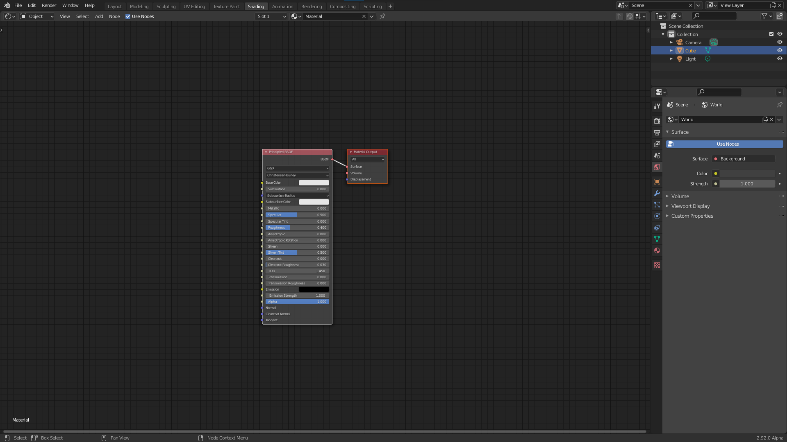
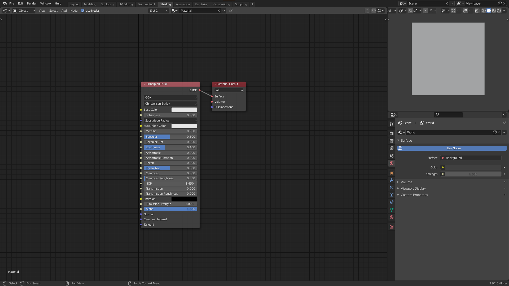

# Your journey begins

In this chapter we will learn how to use math to create shaders. Before we begin I will share my setup for creating shaders in blender. In the beginning these shaders will all be 2D, and we will therefore use a plane as our primitive. If you already have your own setup that you're comfortable with, you can jump right to the [next section](basic_ops.md).

## Setup

Make sure that you have the node wrangler add-on enabled (it is a built-in plugin).
### Layout

Starting from the default blend file open up the shading workspace. Then edit edit the layout so that the file explorer, render preview, and image editor are gone. It should look something like this:

Next change the outliner to the 3D viewport and replace the default cube with a plane. Make sure the default material is assigned to the plane. Then switch the view to top orthographic and turn off all overlays and gizmos. Turn switch the display to rendered. We will use this section as our shader preview. You can resize it to be bigger if you want. The final result should look something like this:

If you want this to be the default every time you open blender you can go to "File > Defaults > Save startup file". Optionally you can also start with [my default file](blendfiles/default.blend). 
