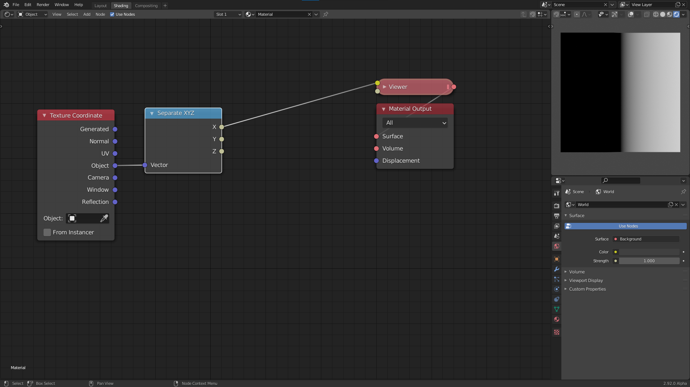
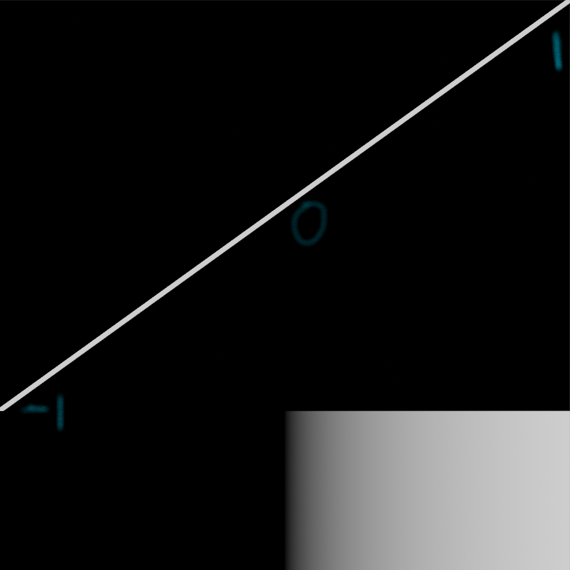
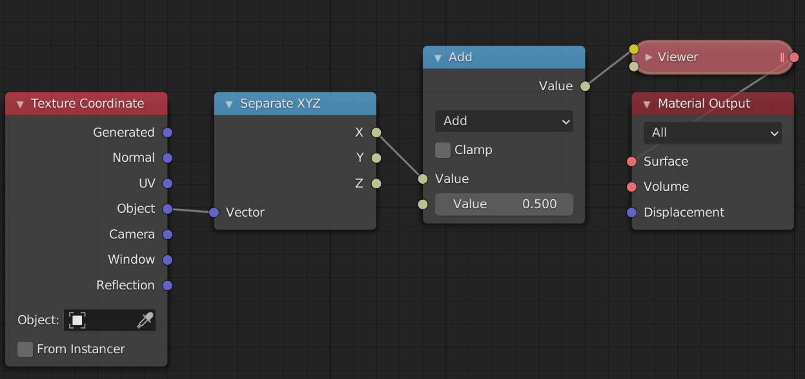
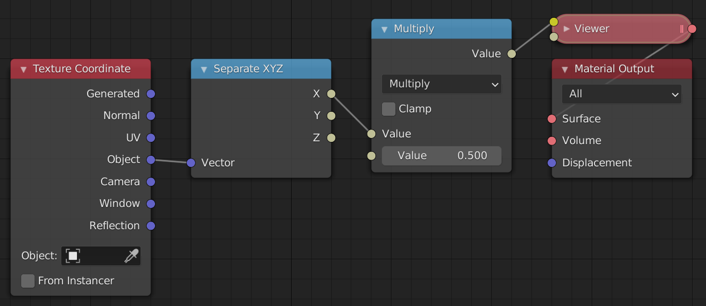
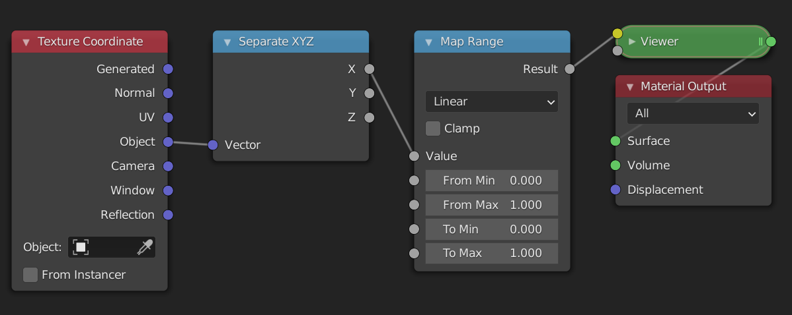
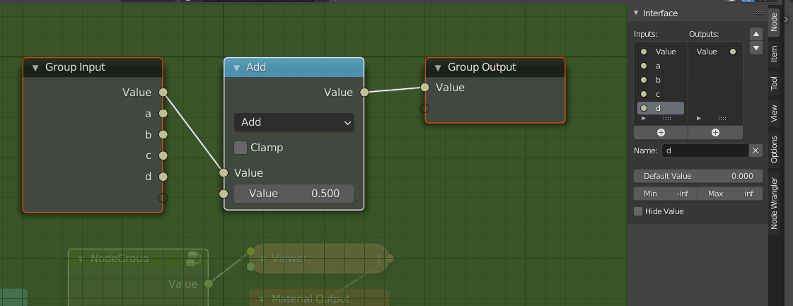
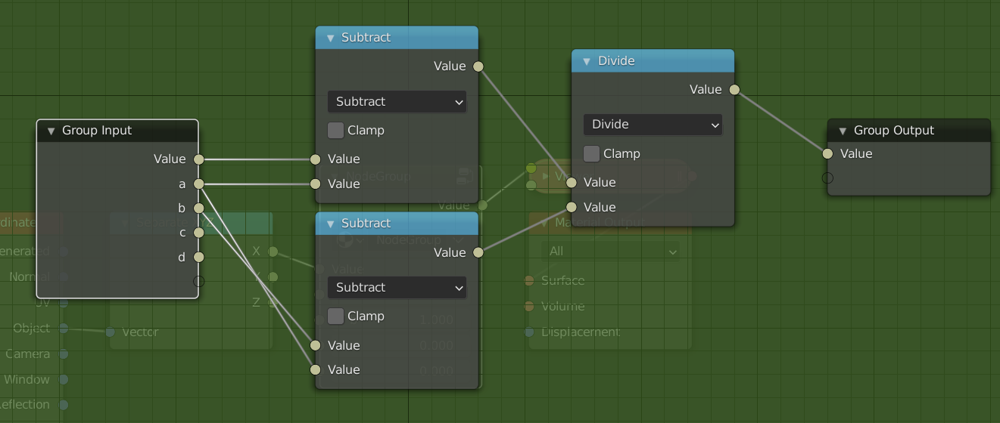
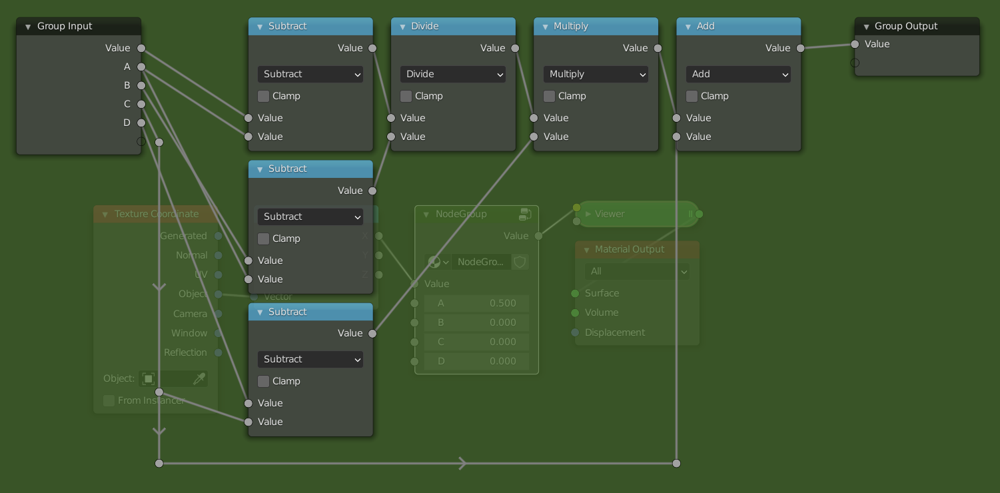
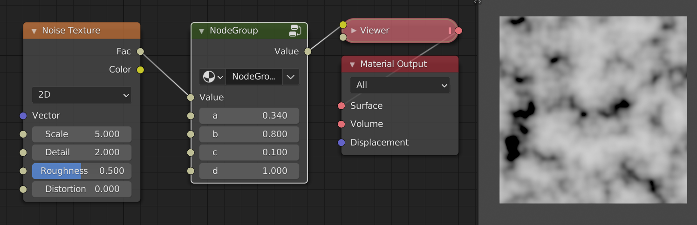

# The basics of the math node

We will start from this node tree:

We will go into more detail on coordinates in a later chapter, for now all you need to know is that the object coordinates are centered at the object origin, and go from -1 to 1 in all three axes in this case. The separate xyz allows us to only look at one axis at a time, in this case the x-axis. The viewer node is just a renamed emission node.

## Thinking in terms of ranges

The current output shows black in the left half and grey values going to white in the right half. This is one way to describe the output, but from this it is not so clear what the actual output values are. A better way to think about the output image is as a *linear gradient from -1 to 1*. The *range* of the gradient is [-1, 1] in this case. What this means is that the pixel value as you move from one side to the other changes from -1 to 1. The change here is along the x axis and goes from left to right (from lower values to bigger values). Because values below 0 are displayed as black, the left half of the image is black. If the gradient was along the y-axis then it would be going from the bottom to the top. 

In addition to the range of values, we can also talk about the *shape* of the gradient. In this case the shape is linear, because when we plot the value of each pixel as we move from left to right the plotted shape is a line:

The most common shape is a linear gradient. 

## The math node

Now that we have learned about gradients and ranges, it is time to manipulate them. In this section we will look at the most basic operations: add, subtract, multiply and divide. What happens when we add a math node in between the separate xyz node and the viewer node? The values that go into the viewer node will now first pass through the math node. The math node will apply an operation to the values that are passed in and return a new value. By default the math node is set to add, and both values set to 0.5. The add, subtract, multiply and divide modes only affect the range and not the shape.

### Add and Subtract

Currently the range is [-1, 1]. When it passes through the math node 0.5 is added to every value in the range. Luckily we don't need to think about what happens to every value in the range. We only need to look at the the two endpoints, i.e -1 and 1. Because we add 0.5 to everything, the range changes from [-1, 1] to [-0.5, 1.5]. You can think of this as moving the line 0.5 units upwards or moving the gradient 0.5 units to the left, whichever is more intuitive for you. 

If we now change the value of the add node, the range will move left or right. Increasing the value of the second input means we make the values in the range bigger, causing them to move to the right on the number line. This means, however, that the darker values will move to the left in the range, and because of that we perceive it as moving the image to the left. If we instead add negative values the result is the complete opposite.

A good way to see this, is to think about the middle value or center of the range. The center of a range represents its position. We can calculate the center of the range [a, b] as
\\[\frac{a+b}{2}\\]
If the range is [-1, 1] then the center is at 0. When we add 0.5 the new range is [-0.5, 1.5] and the center is now at 0.5. The old center, 0, is no longer in the center of the range but has moved to the left in the range, i.e. the old center is to the left of the new center. We will therefore see it as moving to the left. If we subtract values by changing the mode to subtract or by adding negative values, the range will move to the left and the old center will move to the right of the new center.

In conclusion, the add mode allows us to reposition a range. This is sometimes referred to as translation. If we want to move things to the left we add positive numbers, and if we want to move things to the right we add negative numbers.

### Multiply and Divide

We have now seen how to position a range. If this was the only thing we could do with ranges we would be very limited. Luckily the multiply mode allows us to scale the range. To see how this works let's look at an example once again.

The input range is [-1, 1], and we multiply everything by 0.5. This means that the new range is now [-0.5, 0.5]. The center of the old range was 0, and that of the new range is still 0. Therefore the position has not changed. What has changed however is the (signed) length of the range, which we can calculate as follows: 
\\[b-a\\]
The length of the range [-1, 1] is 2, while the length of the new range, [-0.5, 0.5], is 1. This is exactly \\(0.5*2\\), so the length of the old range multiplied by the value in the multiply socket. The length of the range has decreased, which we perceive visually as zooming in. If we were to multiply by a value greater than 1, say 2, then the length would increase giving the effect of zooming out. In addition to increasing or decreasing the length of the range, we can also think of multiplying as darkening or brightening an image. If we multiply by a value less than 1, the values get darker. If we multiply by a value greater than 1 the values get brighter.

What happens if you multiply by a negative number? Let's say we multiply the range [-1, 1] with -1, then the new range is [1, -1]. We have flipped the range! This range has a signed length of -2, this means that instead of increasing from left to right, it now goes from right to left. Visually we perceive this as mirroring the range.

## Summary

To move, translate or reposition a range we can use the "add" or "subtract" mode. To resize, scale or flip a range we can use the "multiply" or "divide" mode.

---
## Example: map range node from scratch

To put our newly learned skills to the test we will recreate the map range node from scratch. The map range node is a very useful node that lets you go from one range to another, by specifying the endpoints. If we wanted to convert the range [-1, 1] to [0.5, 2] we would use these settings:

### Steps needed
To convert from one range [a, b] to the other [c, d] we will use the following steps:
1. Subtract `a` from the range. This will convert it to the range [0, b-a].
2. Make the input range have length 1 by dividing by its length \\((b-a)\\). The new range is now [0, 1]. In many cases when working with ranges, you want to work with a range from 0 to 1, or [-1, 1]. The reasons for this will become clear when we start changing the shape.
3. Resize the range to the length of the output range by multiplying by \\(d-c\\). The range is now [0, d-c]. It already has the correct length.
4. We position the range so that the endpoints match, by adding `c`. The new range is now [c, d]. This is the result we wanted.

For the more mathematically inclined, the full formula looks like this:
\\[
    \frac{x-a}{b-a}(d-c) + c
\\]
where \\(x\\) is the input range.

### The node setup

Add a math node between the separate xyz and the viewer node. Select it and press `Ctrl + G` to make it into a node group. Open up the side panel by pressing `N` to add extra inputs to the node group. Make sure you have 5 inputs then rename them to something by which you can recognize them. 

We will now follow the steps from above but using math nodes. If I refer to socket names, they are the same as in the picture. Notice how the computations with ranges we described earlier are easily translated to operations with the math node.

1. Change the mode of the math node to "Subtract", and connect the `a` socket with the second input of the subtract node.
2. Add a divide node between the subtract node and the group output. Copy the subtract node (`Shift + D`), and connect the `a` socket to the second input and the `b` socket to the first input. (This node will thus compute \\(b-a\\)). Then plug the result of this subtract node into the second input of the divide node.

3. Add a multiply node after the divide node, and a subtract node below the other subtract nodes. Plug the `c` socket into the second input of the subtract node and the `d` socket into the first input. Then plug the result of that into the second input of the multiply node.
4. Now just add an add node after the multiply node and plug the `c` socket into the second input.

#### Final example

Here is a simple example where we used the map range node group to change the range of a noise texture:

