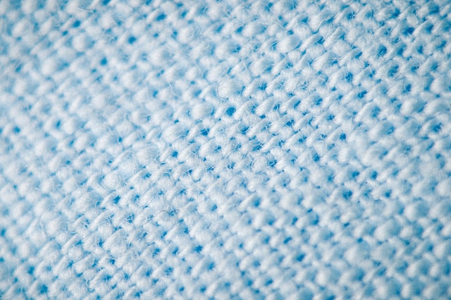
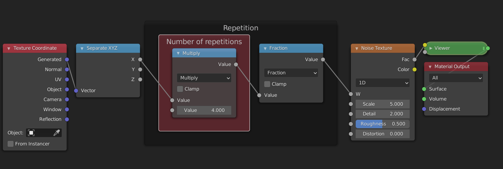
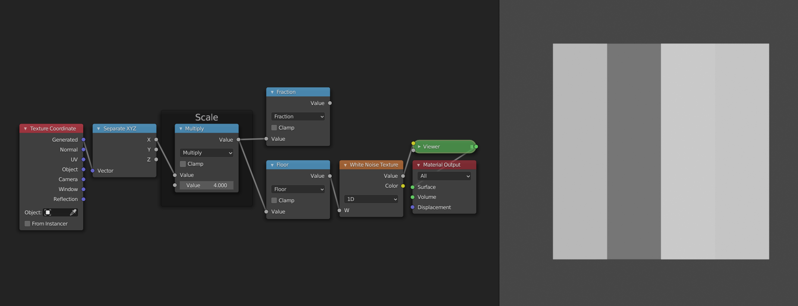
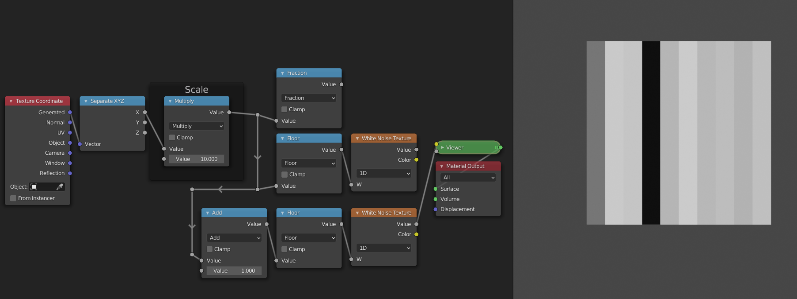
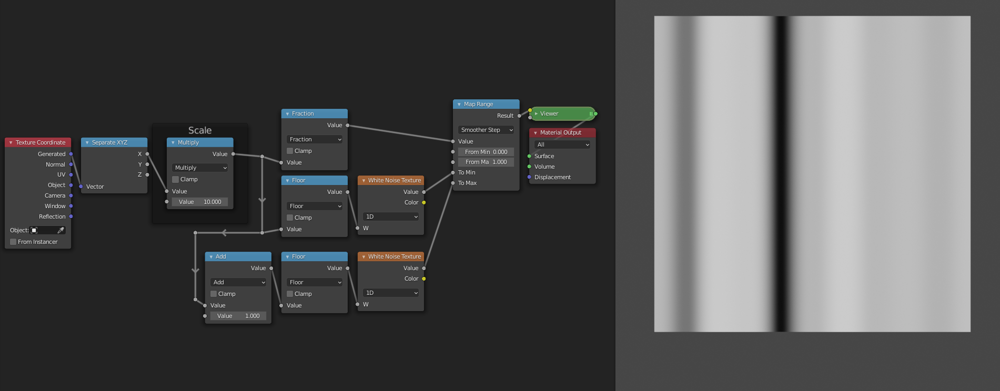

# Repetition

It is very often the case that some pattern appears multiple times on the same material. Think of things like floor tiles, honeycombs, fabrics etc. In this case it is useful to be able to work on one instance of the pattern, and then have it repeat multiple times automatically. The way that we can do this in shaders is by manipulating the input ranges of our pattern to repeat themselves. We can then add some imperfections on top to break up the pattern. Once we move to more dimensions we will see that this is a very powerful tool for creating all sorts of procedural shaders.

## Creating a repetition

The easiest way to create a repeating range is to use the `Fract` mode of the `Math` node. It takes the decimal or fractional part of a number and discards the rest. This means that 0.7 gets sent to 0.7 but 1.24 gets sent to 0.24. Let's take a look at what happens when we plug the range `[0, 2]` in. The values less than 1 will stay the same, for the other values the "1" in front will be removed, and we'll get a duplicate of the range `[0,1]`. Like this we have created a repetition of the range `[0,1]`. The `Fract` mode is a specific case of the more general `Modulo` operation. 

The `Modulo` operation takes in an additional argument, the point at which we want to start wrapping. For `Fract` we start wrapping at one, i.e. once we have more than just a decimal part. If we instead start wrapping at two, for example, then the range `[0,2]` stays unchanged, except for the point 2, which wraps back to 0. The range `[0,4]` gets sent to two copies of the range `[0,2]`. Experiment with the [graphs](#graphs) to get a better feel for how it works. 

Another function that we can use is the `Sine` function. We already encountered it in the previous section. It also repeats ranges, but in a smooth way. Unlike the `Modulo` operation, the shape of the range gets changed by the `Sine` function. It also differs in the fact that it wraps at \\(2\pi\\), the circumference of a unit circle. This is no coincidence, because the `Sine` function can be seen as the height of a point that is moving around a circle. Once the point has completed a full journey around the circle, the pattern repeats.

### Magic?

With the functions described above, we can easily create a repetition where a change to one of the copies is repeated across all other copies. You can easily test this yourself in blender. Start from the following node group and try changing the nodes that come afterwards. You will see that the pattern changes in all copies!

As an exercise you can try to change the nodes so that the repetition uses the `Sine` function instead. Hint: you will need to remap the range to `[0, 2*pi]` before using the `Sine` function, if you want the number of repetitions to be correct.

### Graphs

<iframe src="https://graphtoy.com/?f1(x,t)=fract(x)&v1=true&f2(x,t)=mod(x,%202)&v2=true&f3(x,t)=sin(x)&v3=true&f4(x,t)=floor(x)&v4=true&f5(x,t)=&v5=false&f6(x,t)=&v6=false&grid=true&coords=0,0,15.972000000000234"
name="Repetition" height = "700" style="border: none; display: block; margin: 2 auto; width: 100%"> </iframe>

## Accessing individual elements in a repetition

So what if we want to break up the pattern? If we add some noise after the repetition, it doesn't break up the pattern because the noise will be repeated too. If we add it before the repetition, then the pattern will be distorted. We need to split the range into two parts: the repeated pattern, and the variation for each copy. We have already tackled the repetition, we will now handle the variation. For this we will use the `Floor` mode.

While the `Fract` mode takes the fractional part, the `Floor` mode takes the whole number part. (For negative numbers this is not entirely true, but that doesn't really matter for what we will use it for). The graph of the `Floor` function looks like a staircase. The `Fract` and the `Floor` mode also have a very nice mathematical relationship: `fract(x) + floor(x) = x`. This is because the `Floor` function tells us in which copy we are, while the `Fract` function tells us where in the copy we are. The combined information says exactly where we are. The `Floor` function has only one value per copy. This means that any noise that use after the `Floor` function will have the same value on one copy, but different values for each copy. 

## Example: 1D noise

These explanations are all nice and well, but let's have a look at how we can actually use them. If we want a random value per pixel, we can use the `White Noise Texture` node. More often than not, we instead want a smooth kind of noise. For this we can use the `Noise Texture`. We will now see how you can use the `White Noise` texture to make the `Noise Texture` in the one-dimensional case.

### Repetition

Because we are in search of "smooth" noise, we don't want a random value per pixel. Instead, we want to have control over the spacing of the random values. We will then interpolate between the different values to create a smooth transition. The first node tree looks like this: 

It just gives us a random value per cell/copy of the input range. This works because the `Floor` function is constant over each copy, and thus the random value from the `White Noise Texture` is also constant for each copy.

### Interpolation

To interpolate between two values, we first need two values. Currently we only have one value, i.e. the one generated by the white noise texture. For the second value we will use the random value of the copy to the right. To access this value we can just shift the input range by 1, because the ranges are wrapped at 1. You can verify for yourself that this works by comparing the outputs of the two `White Noise Texture` nodes.

The interpolation itself is easy now. We just need to add a `Map Range` node. For the `Value` socket we can plug in the ranges generated by the `Fract` node. Since these go from 0 to 1 we can leave the `From min` and `From max` sockets unchanged. For the `To min` socket we can use the first randomly generated value, and for the `To max` socket we can use the value of the copy to the right. This will make it so that the values transition from the value of this copy to the value of the right copy as we move from left to right. As a final step we can set the interpolation mode to "Smootherstep" to get a smooth shape as a result.

### Layers

The observant among you may have noticed that the `Noise Texture` node has more options than just `Scale`. This is because it uses `Fractal Brownian Motion`. Multiple copies of the node group that we have just made are added on top each other with decreasing scales. The `Detail` socket controls how many layers. The `Roughness` socket determines by how much we scale down the consequent layers, so that the smaller details will contribute less to the final result. Although we can add layers manually by copying our node groups, there is currently no way to procedurally control how many layers we have. For that reason we will not implement this aspect of the `Noise Texture` node in our version.
