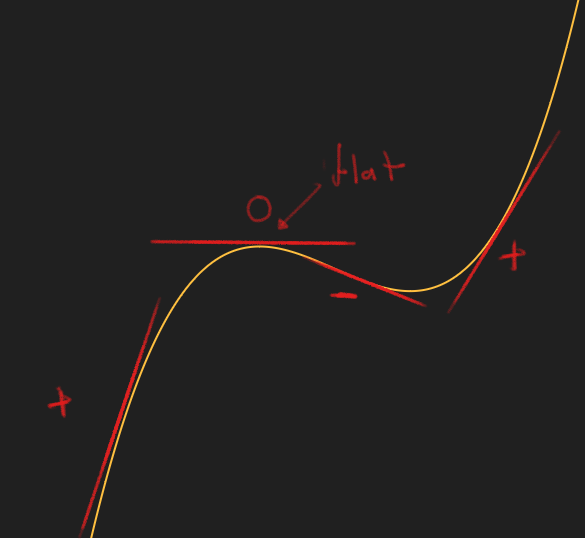
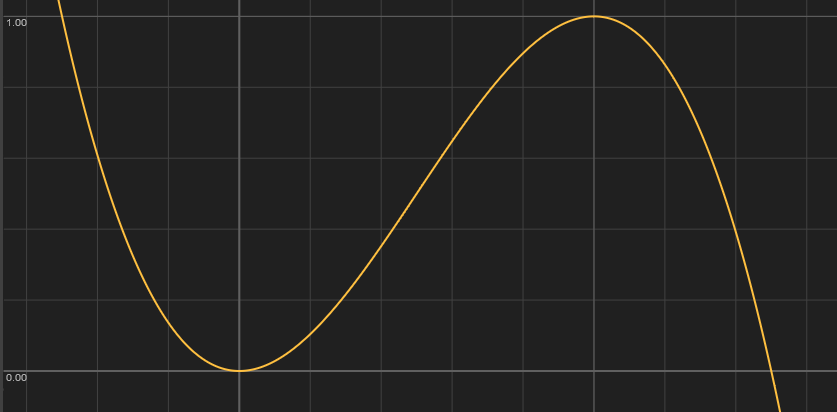
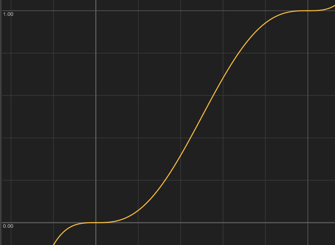
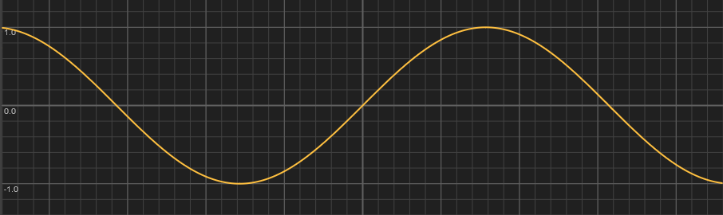
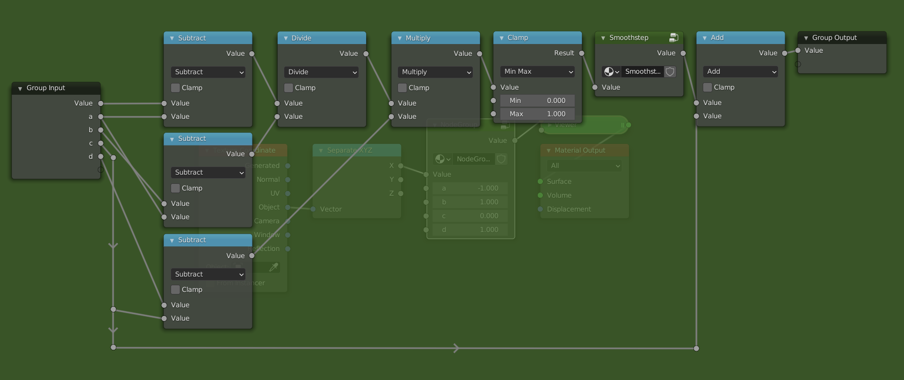

# Shape

We have just learned how to transform a range using the `Math` node. Now it is time to also change the shape, for which we will be using the `Math` node as well. The functions that we will be looking at are `Power`, `Sine`, `Smoothstep` and `Smootherstep`.

## Power

The `Power` mode of the math node is a powerful tool that allows us to change the shape or interpolation of a gradient. The mathematical operation is \\(a^b\\), as is also shown in the tooltip. There are two ways to use this:

1. We let `a` be constant, and plug the range into the `b` socket. This gives us an exponential function with base `a`. If we chose `a` to be 2, for example, then we would get the function \\(2^x\\). The exponential function is not so useful when changing the shape, but comes up a lot in mathematical formulas. 
2. In the other case we make `b` constant and plug the range into the `a` socket. In this case we are raising the range to the `b`-th power. This is something that we will use a lot in the future. We will refer to it as the power function from now on.

The two functions look like this:

<iframe src="https://graphtoy.com/?f1(x,t)=(sin(t)+1)*5&v1=false&f2(x,t)=pow(f1(x,t),x)&v2=true&f3(x,t)=pow(x,f1(x,t))&v3=true&f4(x,t)=&v4=false&f5(x,t)=&v5=false&f6(x,t)=&v6=false&grid=true&coords=-0.221702458210423,1.253803500548723,2.3859407407407427"
name="Power and Exponential function" height = "700" style="border: none;display: block; margin: 2 auto; width: 100%"></iframe>

The constant value is animated through time between 0 and 10 by a sine wave, an incredibly useful function that we will cover soon. Feel free to experiment by changing the values of the functions.

Here are some observations we can make from the graph
- The functions seem to flip at a certain threshold, to be exact at a value of 1.
- The power function is only shown on the right hand side (the positive x axis).
- The power function always passes through the points `(0,0)` and `(1,1)`, and is constantly rising (i.e. as you move from right to left the values increase). 
- The exponential function always passes through `(0,1)`.

The third property is the most important one. Another way to formulate it is as follows: "If you plug a `[0, 1]` range in the power function, you get back a `[0, 1]` range, but with a different shape". This property is also true for the other functions that we will be looking at. If we look at the shape of the curve, we can see that it is not flat at the points `(0,0)`and `(1,1)`. This means that we might get sharp transitions when combining this function with others. The following three functions fix this problem.

## Sine, Smooth and Smoother

We will limit ourselves to the range `[0, 1]` for these functions, as this makes things considerably easier. At the end of the section we will see how we can overcome this limitation.

### Derivatives
To make a function that is flat at the edges, we first have to define what it means for a function to be flat. Intuitively a function can be considered flat at a point, if we can balance a book on the graph of the function. A more mathematical way would be to say that the function has a slope or derivative of zero at that point. Intuitively the slope says by how much a function is rising at that point. If the slope is negative, the function is decreasing, and if the slope is positive it is increasing. When the slope is 0, it is neither increasing nor decreasing and thus flat. The following image illustrates the different concepts we just talked about.

What follows is a bit more of a technical explanation, so feel free to skip over it and go straight to the [summary](#summary).
### Construction of the functions
The simplest kinds of functions are the polynomials, they form the building blocks for more complex functions. Not only are they simple to write down, they can also be evaluated very quickly, making them ideal for computer graphics. Another useful property of polynomials is that through \\(n+1\\) distinct points, there is a unique polynomial of degree \\(n\\), a more general formulation of the well known property that two points determine a line. So what degree polynomial do we need to get a function that satisfies the properties we want? The properties are:

- Goes through `(0,0)` and `(1,1)`
- It is flat at `(0,0)` and `(1,1)`

These are four conditions, meaning that we have a unique polynomial of degree 3 which satisfies these properties. This polynomial, commonly known as `Smoothstep`, looks like this

\\[
   -2x^3+3x^2 = x\cdot x\cdot (3-2\cdot x)
\\]
The right hand side of the equation is the one used in computer graphics, because it requires less computational steps to evaluate than the one on the left. Anyone who has had an introduction to calculus should be able to verify that this function does indeed meet the constraints. This function satisfies the properties we have described, but is not "smooth" enough in some cases. To fix this we use the so-called `Smootherstep`, which adds two extra conditions.

- Goes through `(0,0)` and `(1,1)`
- It is flat at `(0,0)` and `(1,1)`
- The second derivative (the derivative of the derivative) is flat at `(0,0)` and `(1,1)`

The new conditions ensure that the boundaries are very flat. Because we have 6 conditions, we now need a degree 5 polynomial.
 
\\[
    6x^5-15x^4+10x^3 = x\cdot x\cdot x\cdot (x\cdot (x\cdot 6-15)+10)
\\]

What if we don't want to use polynomials? In that case, good candidates are the trigonometric functions like `Sine`, `Cosine` and `Tangent`. The problem here is that they are more expensive to evaluate, and less suited for the task. Another reason, is that they are approximated very well by polynomials. In fact any continuous function on a closed interval can be approximated as closely as desired by polynomials. This result is known as the Stone-Weierstrass theorem. This means that we are finding more complex polynomials to solve the same problems. If we do want to use `Sine`, we have to do some transforms on ranges to get it to line up. We will go into more detail on the `Sine` function when we talk about repetitions.

The value of `Sine`, goes from -1 to 1 as the input goes from \\(-\pi/2\\) to \\(\pi/2\\). Luckily for us it's already flat at the edges. Our goal is to make it go from 0 to 1 as the input goes from 0 to 1. To do this, we can use similar steps to the ones we used for the `Map Range` node. To go from `[-1,1]` to `[0,1]`, we simply add 1 and divide by 2. For the input we multiply \\(x\\) by \\(\pi\\) and add \\(-\pi/2\\). The final function looks like this:
\\[
    \frac{\sin(\pi x - \pi /2)+1}{2}
\\]

## Different ranges

To make the functions work on ranges other than `[0,1]` we can use the steps we used to create the `Map Range` node from scratch, with one new step in the middle. Like before, we have an input and an output range, e.g. `[a,b]` and `[c,d]`.

- First remap the range to `[0,1]` by subtracting `a` and dividing by `b` - `a`.
- At this point it is possible that the values exceed the `[0,1]` range, if the actual input exceeded the `[a,b]` range. To fix this we `Clamp` the input between 0 and 1, i.e. values less than 0 go to 0, and values greater than 1 go to 1. Now we apply the function to the clamped range.
- We can now remap the range (with a changed shape) from `[0,1]` to `[c,d]`, by multiplying by `d` - `c` and adding `c`.

The updated node group looks like this:

Making the `Smoothstep` node group is left as an exercise. This now has basically the same functionality as the actual `Map Range` node.
## Summary
Here is a plot of all the functions we looked at.

<iframe src="https://graphtoy.com/?f1(x,t)=(sin(t)+1)*5&v1=false&f2(x,t)=x&v2=false&f3(x,t)=pow(x,f1(x,t))&v3=true&f4(x,t)=x*x*(3-2*x)&v4=true&f5(x,t)=(sin(x*PI-PI/2)+1)/2&v5=true&f6(x,t)=x*x*x*(x*(x*6-15)+10)&v6=true&grid=true&coords=0.5,0.5,0.6666666666666666"
name="Different shapes" height = "700" style="border: none; display: block; margin: 2 auto; width: 100%"> </iframe>