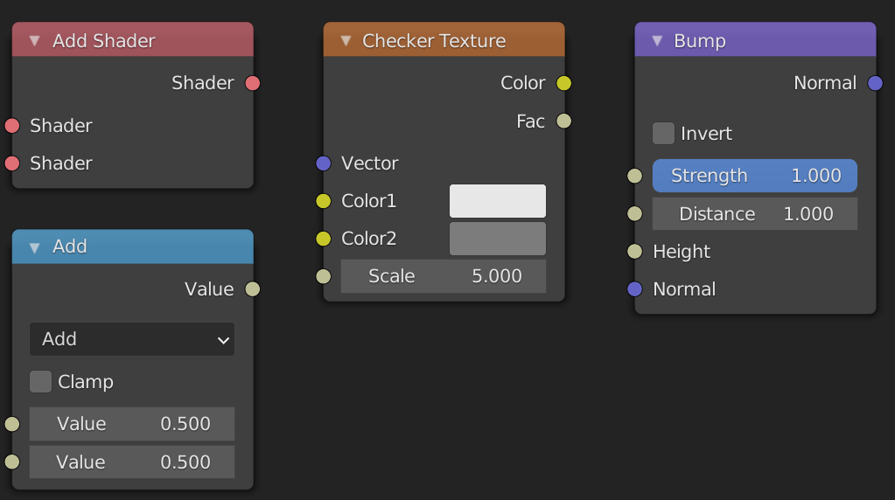
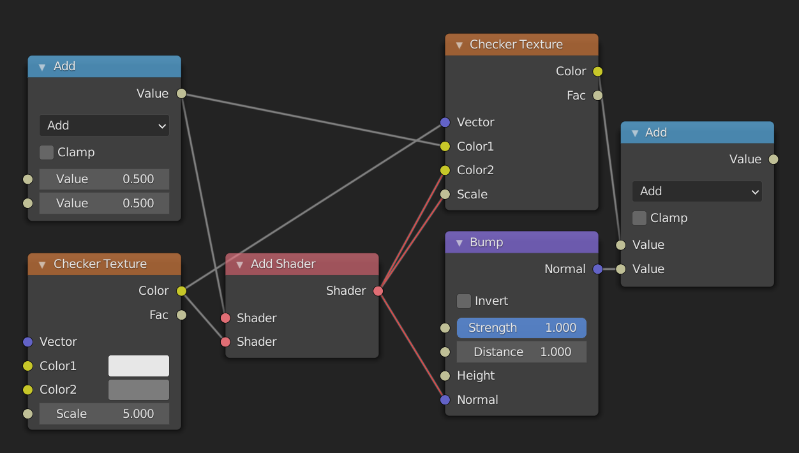

# Sockets

When working with nodes, it is very important to keep in mind that the data that gets passed through the network can be of different types. The types used in the shader editor are: value, color, vector, and shader. The node sockets indicate the type of value the node expects as input and the type it outputs. You can easily see the type by looking at the color of the socket

- Values are indicated with greyish sockets
- Colors are indicated with yellowish sockets
- Vectors are indicated with blue/purplish sockets
- Shaders are indicated with greenish sockets

You can see the different types of sockets here:



## Different types

As long as we plug data of the same type into sockets of the right type, everything works fine. What happens when we connect two sockets of different types? Most of the time this will work, even though it might not do what you think it will. The only time it doesn't work is when you try to connect a shader socket with any other non-shader socket. In that case the connection will be made red, and the shader won't compile. If you want to convert a shader to a color you have to use the `Shader to RGB` node which only works in EEVEE. You can see the different possibilities here:



So what happens when it does work? The answer depends on the types of the sockets. The following descriptions may not be one hundred percent accurate, but they do suffice for things that we need them for.

### Color socket

The data stored in a color socket is made up of three values stored together as `(r, g, b)`. These are the red, green, and blue values of the color. Here are the possibilities for implicit conversion:

- Color -> Shader. The color output gets treated as an emission shader with strength one.
- Color -> Vector. The `(r, g, b)` gets sent to `(x, y, z)`.
- Color -> Value. The returned value is the luminance: `0.2126729*r + 0.7151522*g + 0.0721750*b`. This is the same as the `Color to BW` node, and leaves grayscale values unchanged.

### Vector socket

The data stored in a vector socket is the same as the data stored in a color socket, except that the labels are now `(x, y, z)`. These are the conversions:
- Vector -> Shader. Same as Vector -> Color -> Shader.
- Vector -> Color. The `(x, y, z)` gets mapped to `(r, g, b)`.
- Vector -> Value. The average is taken, i.e. \\(\frac{1}{3}(x+y+z)\\). Note that this is different from the conversion Color -> Value.

### Value socket

This just stores one value, hence the name. 
- Value -> Shader. The output gets treated as an emission shader with color `(1.0, 1.0, 1.0)` (white) and strength the value.
- Value -> Color. The red, green, and blue channels are set to the value.
- Value -> Vector. The x, y and z components are set to the value.

### Summary

Converting between Color and Vector does nothing. Converting from Value to Vector or Color makes three copies of the value. Converting from Color to Value takes the luminance, and converting from Vector to Value takes the average. In this case information is lost, i.e. Vector -> Value -> Vector will not necessarily be the same as the original vector. Converting to Shader is done through an `Emission Shader`.

## Separate and Combine

If you don't want to lose information because of implicit conversions, you can use the `Separate XYZ` node and the `Separate RGB` node to extract the individual components. If you then want to combine them later in the node tree you can use the `Combine XYZ` and `Combine RGB` nodes.

---

## Blender documentation

You can find more info [here](https://docs.blender.org/manual/en/latest/interface/controls/nodes/parts.html#conversion).

## Source code

The information for how the conversion works, is based on the following snippets in the blender source. 

intern\cycles\render\graph.cpp
```cpp
if (from->type() != to->type()) {
    /* can't do automatic conversion from closure */
    if (from->type() == SocketType::CLOSURE) {
        fprintf(stderr,
                "Cycles shader graph connect: can only connect closure to closure "
                "(%s.%s to %s.%s).\n",
                from->parent->name.c_str(),
                from->name().c_str(),
                to->parent->name.c_str(),
                to->name().c_str());
        return;
}

/* add automatic conversion node in case of type mismatch */
ShaderNode *convert;
ShaderInput *convert_in;

if (to->type() == SocketType::CLOSURE) {
    EmissionNode *emission = create_node<EmissionNode>();
    emission->set_color(make_float3(1.0f, 1.0f, 1.0f));
    emission->set_strength(1.0f);
    convert = add(emission);
    /* Connect float inputs to Strength to save an additional Falue->Color conversion. */
    if (from->type() == SocketType::FLOAT) {
        convert_in = convert->input("Strength");
    }
    else {
        convert_in = convert->input("Color");
    }
}
else {
    convert = add(create_node<ConvertNode>(from->type(), to->type(), true));
    convert_in = convert->inputs[0];
}

connect(from, convert_in);
connect(convert->outputs[0], to);
}
else {
    /* types match, just connect */
    to->link = from;
    from->links.push_back(to);
}
```
intern\render\cycles\nodes.cpp in the function `ConvertNode::constant_fold`.
``` cpp
if (from == SocketType::FLOAT) {
    if (SocketType::is_float3(to)) {
        folder.make_constant(make_float3(value_float, value_float, value_float));
    }
}
else if (SocketType::is_float3(from)) {
    if (to == SocketType::FLOAT) {
        if (from == SocketType::COLOR) {
            /* color to float */
            float val = folder.scene->shader_manager->linear_rgb_to_gray(value_color);
            folder.make_constant(val);
        }
        else {
            /* vector/point/normal to float */
            folder.make_constant(average(value_vector));
        }
    }
    else if (SocketType::is_float3(to)) {
        folder.make_constant(value_color);
    }
}
```
intern\cycles\render\shader.cpp
``` cpp
rgb_to_y = make_float3(0.2126729f, 0.7151522f, 0.0721750f);

float ShaderManager::linear_rgb_to_gray(float3 c)
{
  return dot(c, rgb_to_y);
}
```
