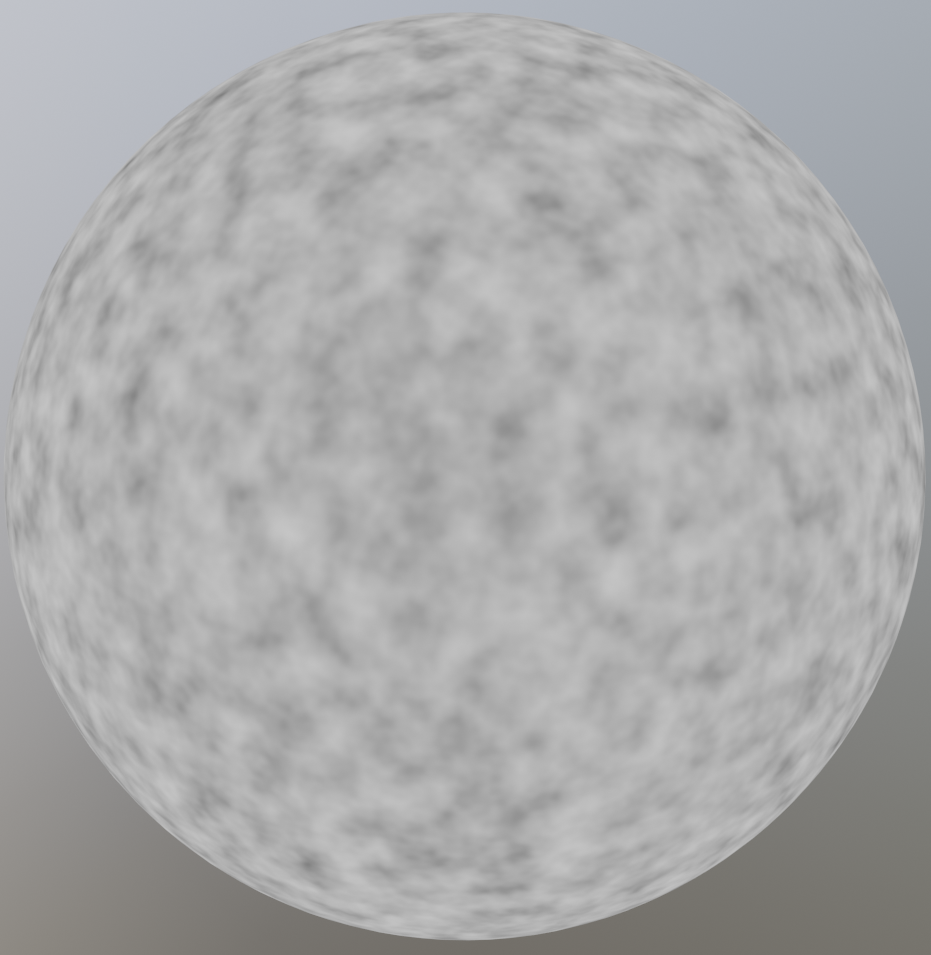
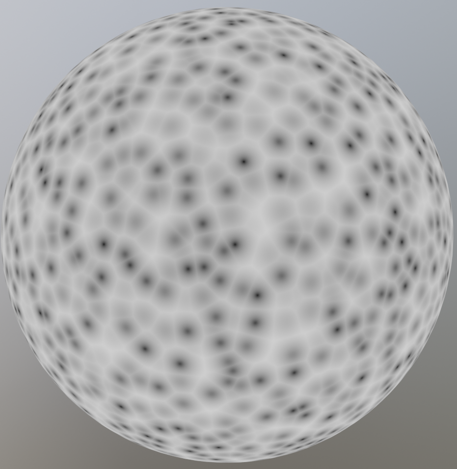
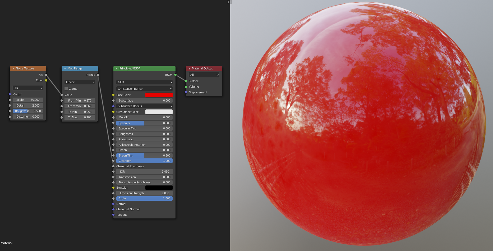
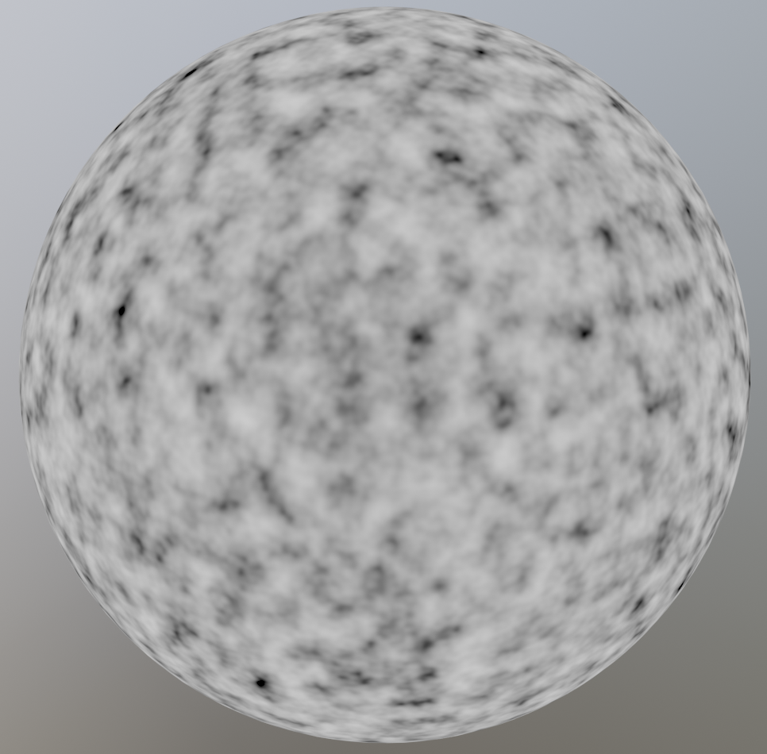

# Shaders and Textures

The goal of this book is to build shaders with blenders node editor. Almost all shaders use a Texture node or a Shader node at some point. The good news is that we can already build a whole range of shaders using only a few of these nodes. We will now cover some of the more common Texture and Shader nodes, and go into more uses in later chapters. If you want to find more information about any node, it is always a good idea to look at [the blender documentation](https://docs.blender.org/manual/en/latest/render/shader_nodes/).

## Shaders

When you create a new material, the default node tree has two nodes. One of these is the `Material Output` node which is the final output of the shader. The other is the `Principled BSDF` which is a very powerful all-in-one shader. By just changing the values of the `Principled BSDF`, you can get the basic look of most materials. This is the basis for most node trees, where textures are plugged into the sockets of the `Principled BSDF` to vary the material properties over the surface. On common way to use it, is to combine texture maps (think of diffuse map, roughness map, normal map, etc.) into one material. There is even a very easy way to do this if you have the node wrangler add-on enabled. Just press `CTRL + SHIFT + T` on the `Principled BSDF`, and select the maps you need. This book is for procedural shaders, however, so we won't be using image textures. 

Other than the `Principled BSDF`, the most common surface shader nodes are the `Emission` shader and the `Glass BSDF` (Although you can technically use the `Principled BSDF`for these as well). The `Emission` shader is particularly interesting, because it does not interact with other rays in the scene, which makes it very easy to compute. For this reason the `Emission` shader is often used to preview the node tree at some point. With node wrangler, you can preview a node by pressing `SHIFT + CTRL + LMB` on that node. The `Glass BSDF` is used when creating glass like objects, but this does not come up very often when creating procedural shaders. 

## Textures

The two most common `Textures Nodes` are the `Noise Texture`, and the `Voronoi Texture`. The `Noise Texture` generates smooth variations which are layered on top of each other with different scales and amplitudes to create fractal noise. The amount of layers can be controlled with the `Detail` socket, with 0 being one smooth layer. The `Noise Texture` can be used to create natural looking surface variations and imperfections. To control the output of the texture, we can use the `Map Range` node, a node that we will cover in detail in later chapters. The `Voronoi Texture` creates cells which are very useful for shaders, where you need to distribute some things randomly over a surface. This can be things like cracks in ice or pebbles on the ground. 

  
   

The image on the left is a `Noise Texture`, and the image on the right is a `Voronoi Texture`.

## Example

A car paint like material with varying roughness to mimic fingerprints. The `Map Range` node is used to increase the contrast in the texture, and limit the roughness to a range of `[0.05, 0.2]`. In practice the maximum roughness should be lower to create a more subtle effect. The idea is that you should only notice the imperfections if you remove them, but this way it's clearly visible on the final image. You can see the output of the `Map Range` node in the second image.
 